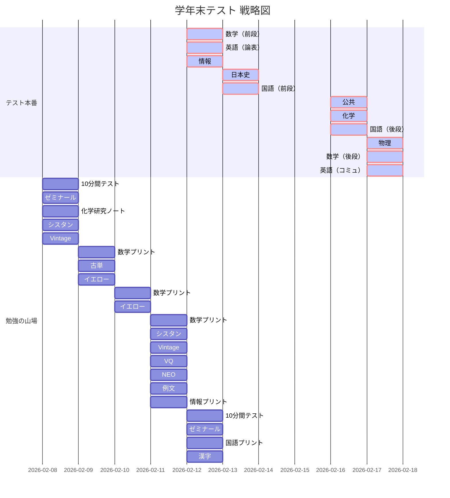

# 📅 テスト・スケジュール

## ✍️ 学年末テスト 実行計画
テスト当日だけでなく、前日の「追い込み」も可視化しています。

| 日付 | 曜日 | 内容 | 状態 |
| :--- | :---: | :--- | :---: |
| 02/12 | 木 | **数学（前段）　英語（論表）　情報** | [ ] |
| 02/13 | 金 | **日本史　国語（前段）** | [ ] |
| 02/16 | 月 | **公共　化学　国語（後段）** | [ ] |
| 02/17 | 火 | **物理　数学（後段）　英語（コミュ）** | [ ] |

## 📊 学習ロードマップ
