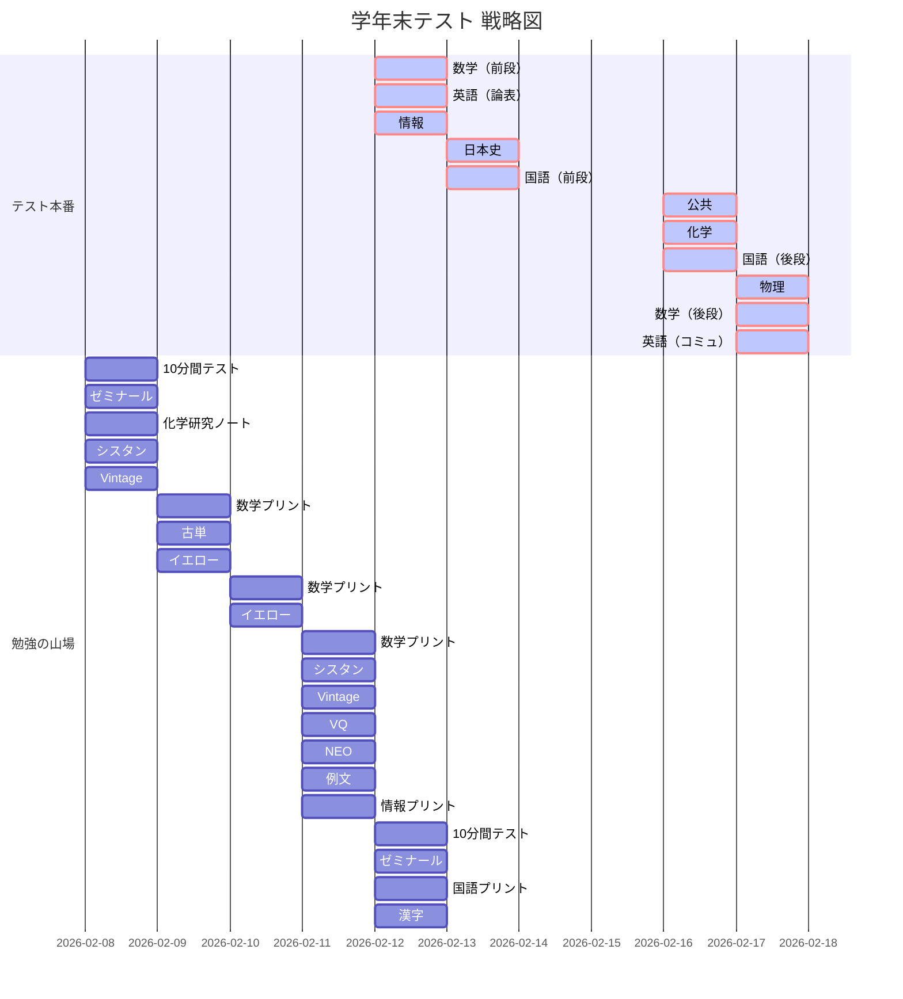

# 📅 テスト・スケジュール

## ✍️ 学年末テスト 実行計画

**テスト日程**
| 日付 | 曜日 | 内容 |
| :--- | :---: | :--- |
| 02/12 | 木 | **数学（前段）　英語（論表）　情報** |
| 02/13 | 金 | **日本史　国語（前段）** |
| 02/16 | 月 | **公共　化学　国語（後段）** |
| 02/17 | 火 | **物理　数学（後段）　英語（コミュ）** |

## 📊 学習進捗・ロードマップ

| 日付 | 重点学習タスク | 完了状況 |
| :--- | :--- | :---: |
| **2/08 (今日)** | 10分間テスト / ゼミナール / 化学研究ノート / シスタン / Vintage | [ ] |
| **2/09 (月)** | 数学プリント / 古単 / イエロー | [ ] |
| **2/10 (火)** | 数学プリント / イエロー | [ ] |
| **2/11 (水)** | 数学・情報プリント / シスタン / Vintage / VQ / NEO / 例文 | [ ] |
| **2/12 (木)** | **テスト1日目** (数学前・英論表・情報) / 次の日(国・日史)の対策 | [ ] |
| **2/13 (金)** | **テスト2日目** (日本史・国語前) | [ ] |
| **2/14-15** | 🚩 **週末の総復習（公共・化学・物理・数学後・英コミ）** | [ ] |
| **2/16 (月)** | **テスト3日目** (公共・化学・国語後) | [ ] |
| **2/17 (火)** | **テスト最終日** (物理・数学後・英コミ) | [ ] |

## 📊 学習ロードマップ
