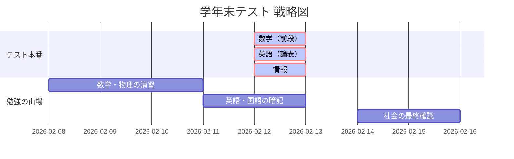

# 📅 テスト・スケジュール

## ✍️ 学年末テスト 実行計画
テスト当日だけでなく、前日の「追い込み」も可視化しています。

| 日付 | 曜日 | 内容 | 状態 |
| :--- | :---: | :--- | :---: |
| 02/12 | 木 | **学年末テスト 第1日** | [ ] |
| 02/13 | 金 | **学年末テスト 第2日** | [ ] |
| 02/16 | 月 | **学年末テスト 第3日** | [ ] |
| 02/17 | 火 | **学年末テスト 最終日** | [ ] |

## 📊 学習ロードマップ
